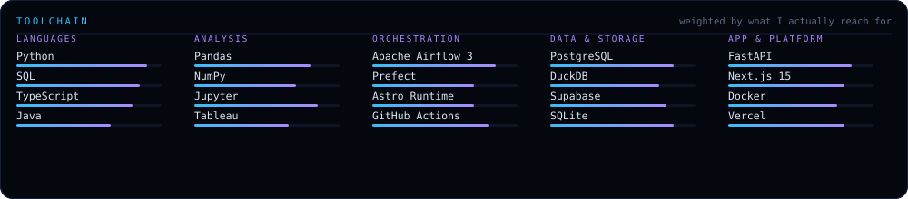
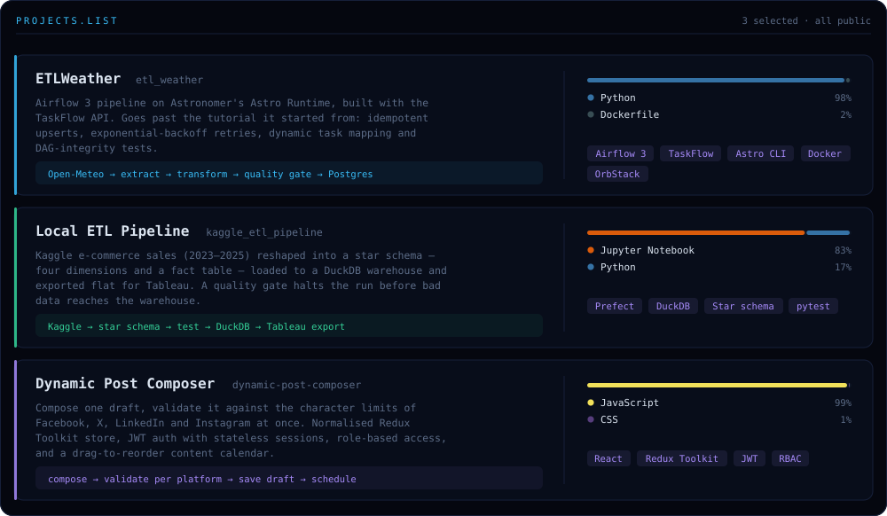
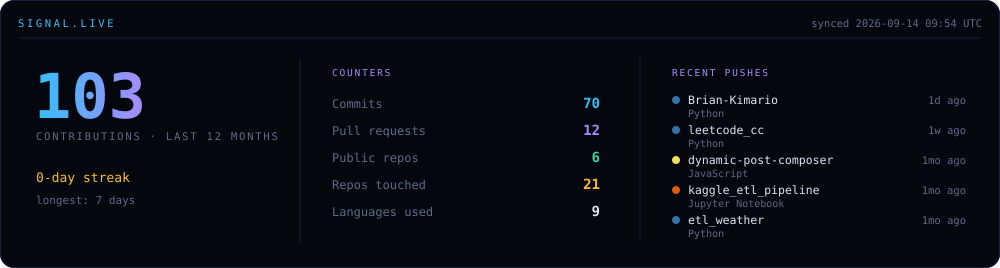

  

**I build the pipeline and the product that sits on top of it.**

Data engineering student from Tanzania 🇹🇿, currently turning my country's
public exam results into something you can actually query.

 

 

## ◤ What I'm actually doing

I spend most of my time on **Matokeo** — a civic data platform for Tanzania's
NECTA examination results. It scrapes results the government publishes as HTML,
parses them into a multi-level relational schema, and serves them through a
FastAPI service that a Next.js frontend reads. No page touches the database
directly; the API is the only data source. ACSEE is covered today; CSEE and
PSLE are next.

The rest of my repos are me getting good at the parts that project needs:
orchestration (Airflow 3, Prefect), warehousing (Postgres, DuckDB, star schemas),
and enough frontend to ship the thing instead of handing someone a CSV.

 

 

 

 

 

## ◤ Where I'm going

Data engineering, properly. The goal for 2026 is an internship where pipelines
break in ways my laptop can't simulate — real volume, real lateness, real
upstream schema changes at 3am. Until then I keep building things that have to
survive contact with actual data: government HTML that changes format without
warning, exam records that don't reconcile, sources with no API at all.

**Open to:** data engineering internships · analytics engineering · anything
where the hard part is the data, not the framework.

 

---

Every panel above is generated from source in [`tools/`](./tools) — no builder
site, no screenshot. The portrait is ~2,600 SMIL-animated particles sampled from
one photo; the stats refresh themselves daily from the GitHub API.
See [`BUILD.md`](./BUILD.md) if you want to take it apart.

